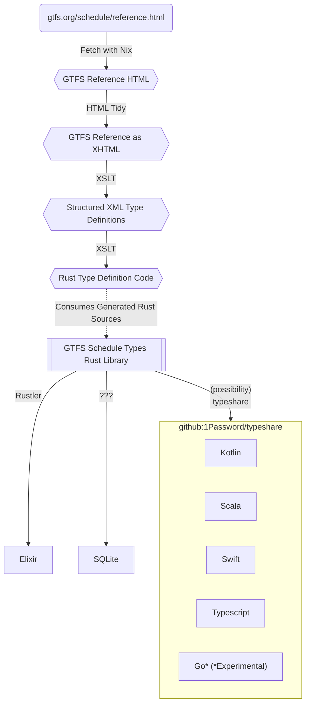

# GTFS Schedule Types Rs

## Intended {Build/Transformation} Process

```mermaid
flowchart TD
	gtfs_schedule_source(gtfs.org/schedule/reference.html)
	
	-- Fetch with Nix -->
		html{{GTFS Reference HTML}}

	-- HTML Tidy -->
		xhtml{{GTFS Reference as XHTML}}

	-- XSLT -->
		xml{{Structured XML Type Definitions}}

	-- XSLT -->
		rs_sources{{Rust Type Definition Code}}

	-. Consumes Generated Rust Sources .->
		gtfs_schedule_types_rs[[GTFS Schedule Types Rust Library]]

	gtfs_schedule_types_rs -- Rustler --> Elixir
	gtfs_schedule_types_rs -- ??? --> SQLite

	subgraph typeshare ["github:1Password/typeshare"]
		direction LR

		Kotlin
		Scala
		Swift
		Typescript
		go["Go* (*Experimental)"]
	end

	gtfs_schedule_types_rs -- (possibility)\ntypeshare --> 
		typeshare
```
